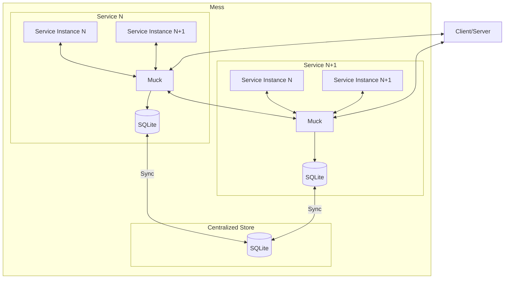

# mess

## Simple service ~~mess~~mesh written in rust!

## features

## Architecture of Mess

### Dev Docs

Deps:

- [sqitch](https://sqitch.org/) (v1.4.1)
- [SQLite](https://www.sqlite.org/index.html) (Version 3.45.3)

#### database

To deploy migration and setup db:

    `sqitch deploy db:sqlite:mess.db`

for info on how to migrate [here](https://sqitch.org/docs/manual/sqitchtutorial-sqlite/) is a good sqitch tutorial
